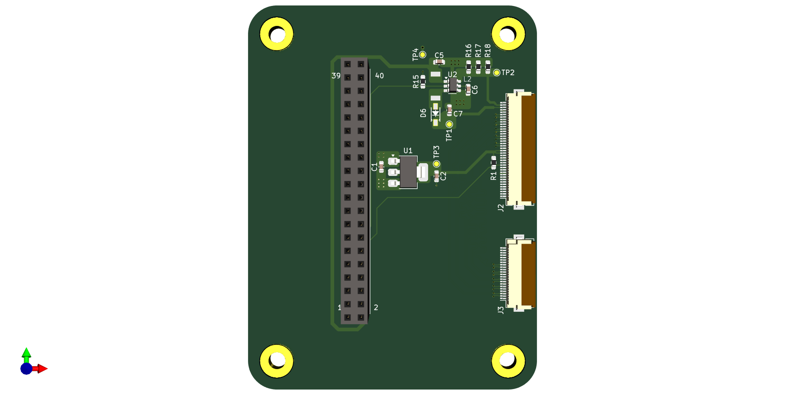

# rpi-mipi-dsi-display
Raspberry CM4 MIPI DSI display shield with LED driver for Midas MDT0500B1IH-MIPI display https://midasdisplays.com/shop/tft/mdt0500b1ih-mipi/ employing the ILI9881C display driver.
This shield serves as a example on how to implement alternative MIPI DSI displays to currently support ones.
PCBA manufacturing was realized by JLCPCB.

## Contents
- KiCAD schematics/board files: [CAD](CAD/)
- Gerber files: [rpi-mipi-dsi-display.zip](CAD/production/rpi-mipi-dsi-display.zip)
- PDF of schematics: [rpi-mipi-dsi-display.pdf](CAD/rpi-mipi-dsi-display.pdf)
- Bill of Materials: [rpi-mipi-dsi-display-BOM.xlsx](CAD/assembly/rpi-mipi-dsi-display-BOM.xlsx)
- KiCAD PCB and pick & place files: [rpi-mipi-dsi-display_CPL1.xlsx](CAD/assembly/rpi-mipi-dsi-display_CPL1.xlsx)

## Copyright and License
Schematic and PCB layout files are licensed under the CC BY 4.0 license.

THE DESIGN IS PROVIDED "AS IS" AND THE AUTHOR DISCLAIMS ALL WARRANTIES WITH REGARD TO THIS DESIGN INCLUDING ALL IMPLIED WARRANTIES OF MERCHANTABILITY AND FITNESS. IN NO EVENT SHALL THE AUTHOR BE LIABLE FOR ANY SPECIAL, DIRECT, INDIRECT, OR CONSEQUENTIAL DAMAGES OR ANY DAMAGES WHATSOEVER RESULTING FROM LOSS OF USE, DATA OR PROFITS, WHETHER IN AN ACTION OF CONTRACT, NEGLIGENCE OR OTHER TORTIOUS ACTION, ARISING OUT OF OR IN CONNECTION WITH THE USE OR PERFORMANCE OF THIS DESIGN.
